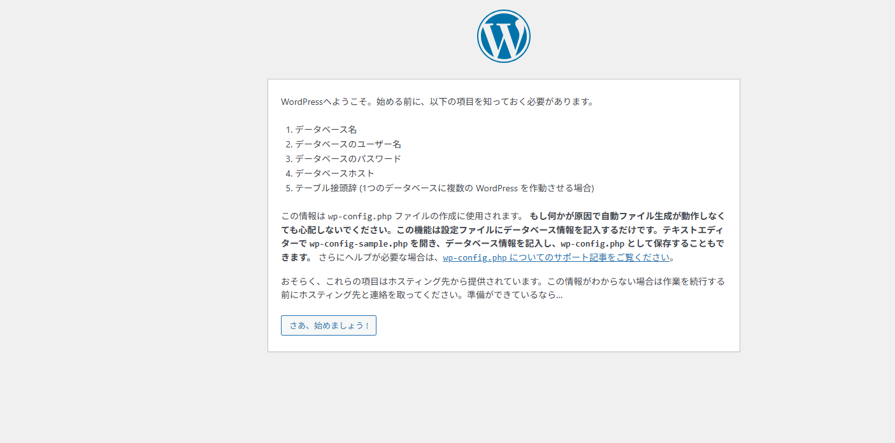

# 構築手順書（LAMP + Zabbix + Postfix）

## 1. サーバー構成

| サーバー名     | 主な構成                                             |
|----------------|------------------------------------------------------|
| LAMPサーバー   | Apache / PHP / MariaDB / WordPress / ufw / fail2ban / logrotate |
| Zabbixサーバー | Zabbix / Postfix                                     |

---

## 2. LAMPサーバー構築手順

### 2.1 Apacheインストール

```bash
sudo apt update
sudo apt install apache2 -y

### 2.2 PHPインストール

```bash
sudo apt install php libapache2-mod-php php-mysql -y
php -v

### 2.3 MariaDBインストール・初期設定

```bash
sudo apt install mariadb-server -y
sudo systemctl start mariadb
sudo mysql_secure_installation

### 2.4 WordPress配置

```bash
cd /var/www/html
sudo rm index.html
sudo wget https://ja.wordpress.org/latest-ja.tar.gz
sudo tar -xvzf latest-ja.tar.gz
sudo mv wordpress/* .
sudo rmdir wordpress
sudo rm latest-ja.tar.gz
sudo chown -R www-data:www-data /var/www/html
sudo chmod -R 755 /var/www/html

作業後、Webブラウザで `http://<LAMPサーバーのIPアドレス>/` にアクセスし、  
WordPressの初期セットアップ画面が表示されることを確認する。

### ✅ WordPress 初期画面確認




### 2.5 WordPressのデータベース接続設定

#### ① MariaDBでWordPress用のDBとユーザーを作成

```bash
sudo mysql -u root -p

CREATE DATABASE wordpress DEFAULT CHARACTER SET utf8mb4 COLLATE utf8mb4_general_ci;
CREATE USER 'wpuser'@'localhost' IDENTIFIED BY 'password';
GRANT ALL PRIVILEGES ON wordpress.* TO 'wpuser'@'localhost';
FLUSH PRIVILEGES;
EXIT;


